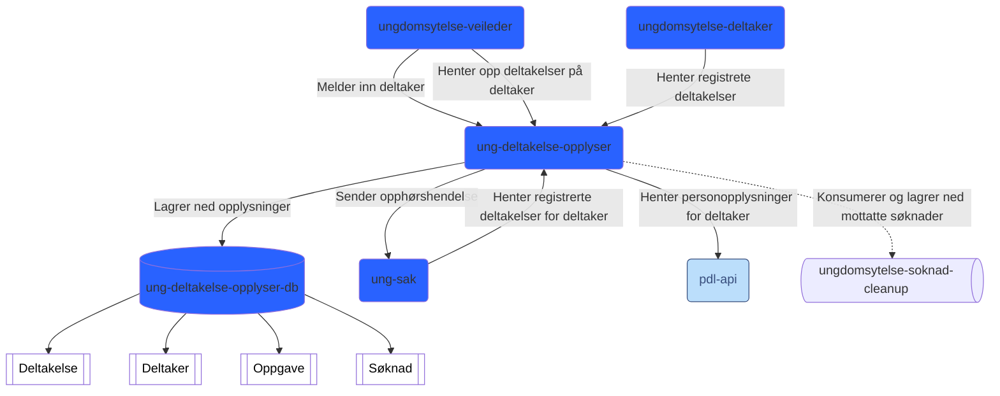

# UNG Deltakelse Opplyser


# Innholdsoversikt

* [1. Kontekst](#1-kontekst)
* [2. Funksjonelle Krav](#2-funksjonelle-krav)
* [3. Begrensninger](#3-begrensninger)
* [4. Programvarearkitektur](#5-programvarearkitektur)
* [5. Kode](#6-kode)
* [6. Data](#7-data)
* [7. Infrastrukturarkitektur](#8-infrastrukturarkitektur)
* [8. Distribusjon av tjenesten (deployment)](#9-distribusjon-av-tjenesten-deployment)
* [9. Utviklingsmiljø](#10-utviklingsmilj)
* [10. Drift og støtte](#11-drift-og-sttte)

# 1. Kontekst
Tjenesten lytter på hendelser om innmelding/utmelding av ungdommer i programmet, lagrer ned opplysningene, oppretter oppgave for deltaker på mine-sider, og sender opplysingene til ung-sak.

# 2. Funksjonelle Krav

Denne tjenesten understøtter behovet for:
- lytte på hendelser om innmelding/utmelding av deltakelse i ungdomsprogrammet,
- lagre ned opplysninger om deltakelse i ungdomsprogrammet, 
- tilgjengeliggjøre opplysningene for veileder, deltaker og ung-sak,
- opprette oppgave for deltaker på mine-sider,
- sende opphør av deltakelse til ung-sak.

# 3. Begrensninger

# 4. Programvarearkitektur

# 5. Kode

# 6. Data

# 7. Infrastrukturarkitektur

## System Context Diagram

Link til [mermaid](https://www.mermaidchart.com/play#pako:eNqVU8GO0zAQ_RUrKyGQ6hUUxIocECpphASIQ7k1e_Am0ySKa0e2u0u02s_hH_beH2McO2mTNtWSk_3evDfjmcljkMoMgjDYcPmQFkwZ8jtKBMFvJ3J6DyWHDNTrJMBrJre6McA19EQSvCGUkp_A8UJKIUgG3LAKL5R-bj0U5KU2nQf1vDWRdc0b3ZqcprS230CgkGAcOcgUqfd_p9McnDrEOv1gucKTgIy4rKIU-Rk1ze7W04Uii7Xenk-xApG5Yov9s9KFvaK4T6FZ5Z3xNHjysYt_cg1KSzEodSPV8NV1ximrSzT1pwnTa_JdCr3bgu2AzAk_9GIrjWHGANH750owW_81OnuYamnB9Xj4DqYpByZ2dRIcNaQr8GRhOsIvjH-mK1IBVnA84OmZYuvOyNVIf9KqywuCY22jjiZu2B2HNb486jF85y151fuehCgfgEPL2f2RxS8HeNp32tLALb1ygKUT4Yob9v_LI9EFqyEkBU0b_uRiuvGHYbiqGoelnGkdwYYgQrAxsgL6UGamCN_Vf2YdkjG0U4o1oZACOji8en_zIbr5OiObkvPwajlfLuJ4RlLJpepIl0abhsPwZ3Wa-aeP8zgeB_Wb-JIgO4tLcXYBpnjfEc8vFtEyXoz1_VpMmYyXwAfG7Tfz3Xjbfmdk6r9Eg1V5oWawPxc0wdM_Blj_JQ) for å redigere diagrammet.

# 8. Distribusjon av tjenesten (deployment)

Distribusjon av tjenesten er gjort med bruk av Github Actions.
[Ung Deltakelse Opplyser Build](https://github.com/navikt/ung-deltakelse-opplyser/actions/workflows/build-and-deploy.yml)

Push/merge til dev-* branch vil teste, bygge og deploye til testmiljø.
Push/merge til master branch vil teste, bygge og deploye til produksjonsmiljø og testmiljø.

# 9. Utviklingsmiljø

## Forutsetninger

* docker
* Java 21
* Kubectl
* Maven

## Bygge Prosjekt

For å bygge kode, kjør:

```shell script
./mvnw clean install
```

## Teste lokalt med VTP via IntelliJ
Forutsetninger:
- Postgresql kjører via Docker med docker config fra [k9-verdikjede](https://github.com/navikt/k9-verdikjede/blob/master/saksbehandling/docker-compose.yml)
- VTP kjører via Docker med docker config fra [k9-verdikjede](https://github.com/navikt/k9-verdikjede/blob/master/saksbehandling/docker-compose.yml)

Bruk run configuration fra .run/UngDeltakelseOpplyserApplication.run.xml

Alternativt:
1. Lag ny run configuration for UngDeltakelseOpplyserApplication
2. Importer environment variabeler fra dev/vtp.env
3. kjør!

## Verdikjedetester
Ende til ende verdikjede tester som involverer denne appen finnes i [k9-verdikjede](https://github.com/navikt/k9-verdikjede/tree/master/verdikjede/src/test/java/no/nav/k9/sak/ung)


## Registrering og henting av data via api-endepunktene

Applikasjonen er konfigurert swagger-ui for å kunne teste ut endepunktene.
For å kunne teste et endepunkt som krever innlogging, må man hente et tokenx token.
Se [Henting av token](#henting-av-token) for mer info.

#### Henting av token i dev-gcp

1. Åpne [Swagger](https://ung-deltakelse-opplyser.intern.dev.nav.no/swagger-ui/index.html) i nettleseren.
2. Trykk "Authorize" i høyre hjørne.
3. Kopier lenken i modalen åpne i ny fane.
4. Velg "TestId på nivå høyt".
5. Oppgi Personidentifikator på testpersonen du vil hente token for, og trykk "Autentiser".
6. Kopier verdien av feltet "access_token" (tokenet).
7. Gå tilbake til Swagger fanen og lim inn tokenet i feltet "Value" og trykk "Authorize".

# 10. Drift og støtte

## Tilkobling til database
For å koble til databasen i dev-gcp kan man kjøre denne hjelpe-scriptet:

```shell script
./scripts/nais-postgres.sh --context dev-gcp --namespace k9saksbehandling --app ung-deltakelse-opplyser
```

## Logging

Loggene til tjenesten kan leses på to måter:

### Kibana

For [dev-gcp: https://logs.adeo.no/s/nav-logs-legacy/app/r/s/6HlTM](https://logs.adeo.no/s/nav-logs-legacy/app/r/s/6HlTM)

For [prod-gcp: https://logs.adeo.no/s/nav-logs-legacy/app/r/s/fiRdf](https://logs.adeo.no/s/nav-logs-legacy/app/r/s/fiRdf)

### Kubectl

For dev-gcp:

```shell script
kubectl config use-context dev-gcp
kubectl get pods -n k9saksbehandling | grep ung-deltakelse-opplyser
kubectl logs -f ung-deltakelse-opplyser-<POD-ID> --namespace k9saksbehandling -c ung-deltakelse-opplyser
```

For prod-gcp:

```shell script
kubectl config use-context prod-gcp
kubectl get pods -n k9saksbehandling | grep ung-deltakelse-opplyser
kubectl logs -f ung-deltakelse-opplyser-<POD-ID> --namespace k9saksbehandling -c ung-deltakelse-opplyser
```

## Alarmer

Vi bruker [nais-alerts](https://doc.nais.io/observability/alerts) for å sette opp alarmer. Disse finner man konfigurert
i [nais/alerts.yml](nais/alerts.yml).

## Metrics

## Henvendelser

Spørsmål koden eller prosjekttet kan rettes til team k9saksbehandling på:

* [\#sif-saksbehandling](https://nav-it.slack.com/archives/CNUPK6T39)

## Kode generert av GitHub Copilot

Dette repoet bruker GitHub Copilot til å generere kode.
